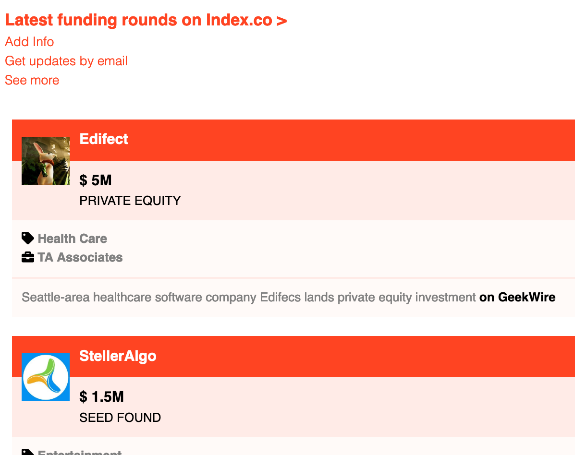
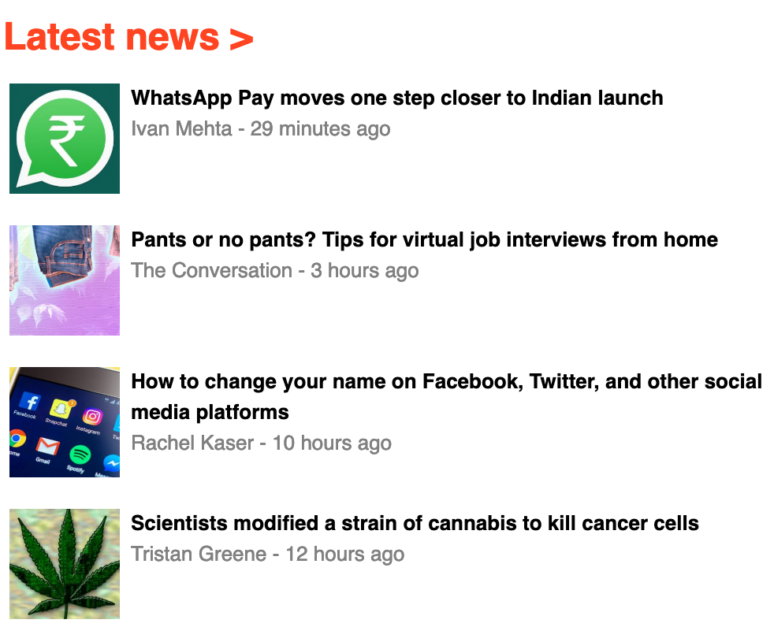
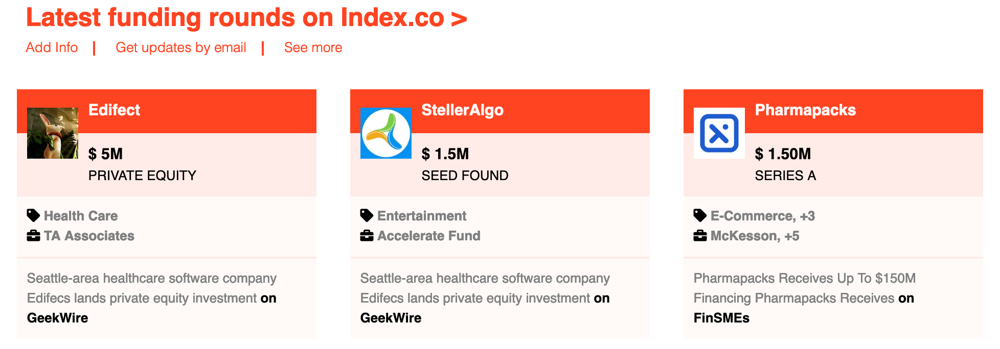

# Building with Responsive Design

> The purpose of this project was to make a responsive webpage for different screen sizes and in doing so we also created a clone of [The Next Web](https://thenextweb.com/)


We used HTML & CSS, including GRID, Flex-Box and media queries. The webpage is visually responsive for all formats including mobile and for you to test this you can re-size the browser and you will see how the layout changes for differnet screen sizes.

## Responsive Changes

### Mobile 

  

### Tablet

 

## Built With
```
- HTML5 
- CSS3
- VS Code
- Font Awesome Icons
```
 
 

## Live Demo

#### Click on image below..

<a href="https://responsive-design-tau.vercel.app/">
    
</a>

## Run Tests

### Install
```
npm i hint
```
### Run
```
npx hint .
```
```
npx stylelint "**/*.{css,scss}"
```


## Authors

👤 **Daniel Ronan**

 [@DcRonan](https://github.com/DcRonan) <br>
 [Daniel Ronan](https://www.linkedin.com/in/danronan10/) <br>
 [@dc_ronan](https://twitter.com/dc_ronan) <br>
 <a href="mailto:danielconnorronan@gmail.com?subject=Hi Dan!"> Email me</a>

👤 **Lamia Sristy**

 [@LamiaSristy](https://github.com/LamiaSristy) <br>


## 🤝 Contributing

Contributions, issues and feature requests are welcome!

Feel free to check the [issues page](enter issues url here).

## Show your support

Give a ⭐️ if you like this project!

## Acknowledgments

- Hat tip to anyone whose code was used
- Inspiration

## 📝 License

This project is [MIT](lic.url) licensed
