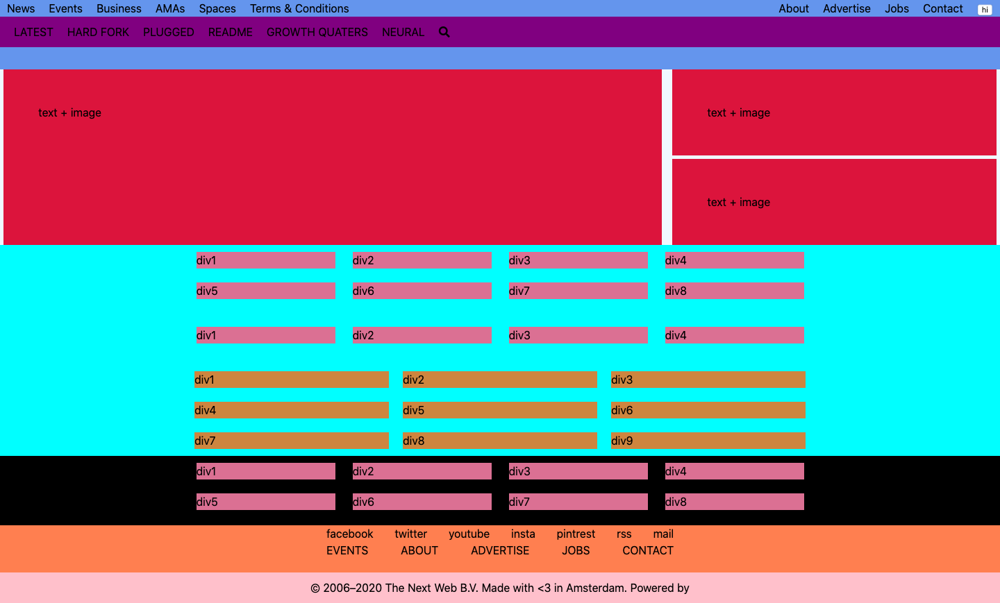

# Building with Responsive Design

> In this project we creted a clone of [The Next Web](https://thenextweb.com/)

We used HTML & CSS, including GRID, Flex-Box and media queries. The webpage is visually responsive for all formats including mobile and for you to test this you can right-click on your browser, click inspect and select the different grey bars at the top which will re-size and you will see how the layout changes and what disappears and pops up.

## Built With

- HTML
- CSS
- VS Code
- Font Awesome Icons

## Live Demo

[Live Demo Link](https://raw.githack.com/DcRonan/responsive-design/main-feature-1/src/index.html)

## Preparation

Below you can see how we prepared our layout, the whole page layout is a GRID layout including the top main section and then the rest of the sections are used by Flex-Box. This gives us a nice idea of where everything is and so that we can keep it tidy.

## Authors

👤 **Daniel Ronan**

- Github: [@DcRonan](https://github.com/DcRonan)
- Linkedin: [Daniel Ronan](https://www.linkedin.com/in/danronan10/)

👤 **Coding Parter**

- Github: [@LamiaSristy](https://github.com/LamiaSristy)

## 🤝 Contributing

Contributions, issues and feature requests are welcome!

Feel free to check the [issues page](enter issues url here).

## Show your support

Give a ⭐️ if you like this project!

## Acknowledgments

- Hat tip to anyone whose code was used
- Inspiration

## 📝 License

This project is [MIT](lic.url) licensed
